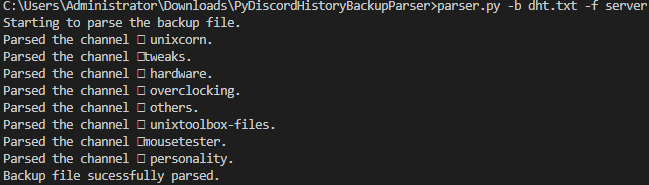

# PyDiscordHistoryBackupParser
A python utility to backup your discord server.
# Tutorial
This parser works in addition with [DiscordHistoryTracker](https://dht.chylex.com/).
To use it you need to download the file provided by DiscordHistoryTracker when a backup of channel is made.
# Requirements
In order, to use the tool you need the requirements, to install them:
`pip install -r requirements.txt`.
# Screenshot

